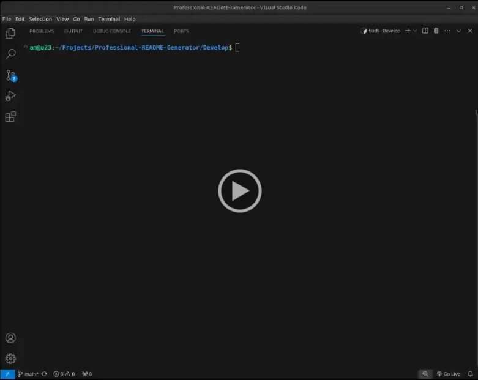

# Professional README.md Generator


## Description

This is a command-line application that generates a professional README.md file for a new project based on user input.

## Table of Contents

- [Installation 🚀](#installation)
- [Usage 🏗️](#usage)
- [Video Demonstration 📹](#video-demonstration)
- [Contributing 🤝](#contributing)
- [Tests ✅](#tests)
- [License 📄](#license)
- [Questions ❓](#questions)

## Installation 🚀

```sh
Run npm install to install all dependencies
```

## Usage 🏗️

```sh
Run node index.js launch the application
```

## Video Demonstration 📹

Below is a video walk through demonstrating the functionality of this project:

<a href="https://drive.google.com/file/d/1V5xWrT-8ZXBQKCTJ-zZFJl2DEJtuXi2n/view">
  
</a>

## Contributing 🤝

To contribute to this project, please fork the repository and create a pull request. For any major changes, please open an issue to discuss what you would like to change.

## Tests ✅

```sh
Run npm test to execute the test suite
```

## License 📄

This project is licensed under the MIT License. You are free to use, copy, modify, merge, publish, distribute, sublicense, and/or sell copies of the software, provided that the original copyright notice and permission notice are included in all copies or substantial portions of the software. For more details, see the MIT [LICENSE](https://opensource.org/licenses/MIT) file.

## Questions ❓

If you have any questions about the project, please feel free to contact me directly:

GitHub: <a href="https://github.com/A-MOHAMED14">A-MOHAMED14</a>

Email: <a href="mailto:amin800@hotmail.co.uk">amin800@hotmail.co.uk</a>
